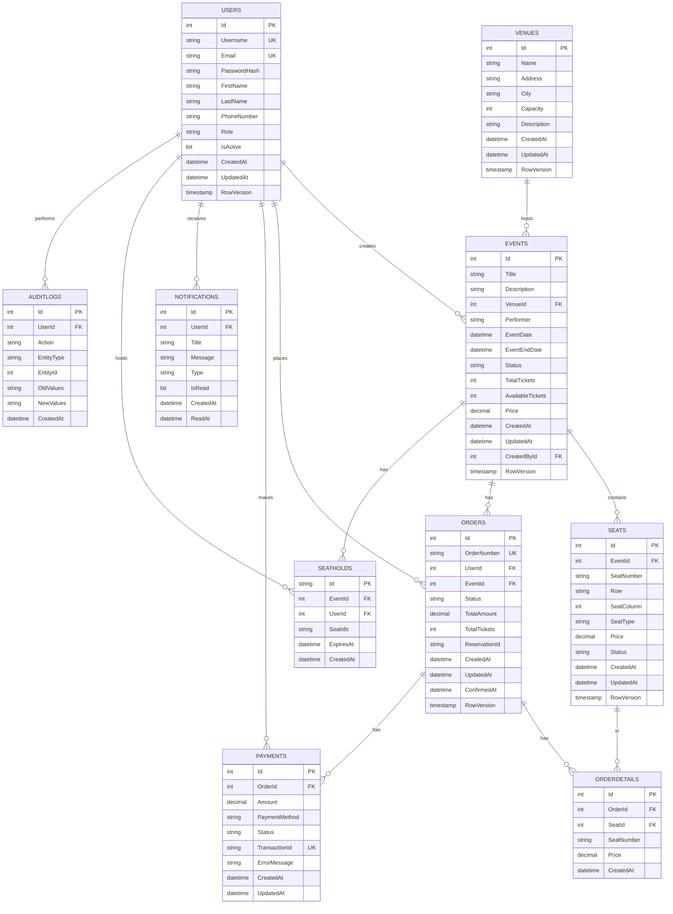

# 🎪 VibeArena - Concert Ticket Booking System

**High-Concurrency Ticketing Platform for Concerts & Sports Tournaments built with .NET 8.0**

## 📌 Tổng Quan Dự Án

VibeArena là một hệ thống **bán vé concert cao cấp** được xây dựng với các công nghệ hiện đại:
- **Backend**: .NET 8.0 (C#) - Modular Monolith Architecture
- **Database**: SQL Server (Optimistic Locking)
- **Cache**: Redis (Seat Holding - 5-10 phút)
- **Message Queue**: RabbitMQ (Async Order Processing)
- **Containerization**: Docker

## 🎯 Các Tính Năng Chính

✅ **Quản lý Sự kiện**
- Tạo, chỉnh sửa, xóa concert
- Quản lý tổng số vé
- Tracking trạng thái sự kiện

✅ **Quản lý Ghế Thông Minh**
- Sơ đồ ghế 2D (Row x Column)
- Giữ ghế tạm thời (5-10 phút) bằng Redis
- Automatic release khi hết hạn

✅ **Chống Bán Quá Số** (High-Concurrency)
- Optimistic Locking (RowVersion)
- Detect khi 2+ người mua cùng ghế
- Rollback transaction tự động

✅ **Xử Lý Thanh Toán Async**
- RabbitMQ queue order processing
- Hỗ trợ nhiều payment gateway
- Retry logic tự động

✅ **Audit Trail & Logging**
- Ghi nhật ký tất cả thay đổi
- Track user actions
- Compliance ready

✅ **Thông Báo Real-time**
- Email confirmation
- Order status updates
- Seat hold expiring alerts

## 📊 Database Schema

### ER Diagram



### Bảng Chi Tiết

| Bảng | Mục Đích | Columns |
|------|---------|---------|
| **Users** | Người dùng | Id, Username, Email, PasswordHash, Role, IsActive, RowVersion |
| **Venues** | Địa điểm tổ chức | Id, Name, Address, City, Capacity |
| **Events** | Sự kiện concert | Id, Title, VenueId, Performer, EventDate, Status, TotalTickets, Price |
| **Seats** | Ghế ngồi | Id, EventId, SeatNumber, Row, SeatColumn, SeatType, Price, Status, RowVersion |
| **SeatHolds** | Giữ ghế tạm (5-10 phút) | Id (UUID), EventId, UserId, SeatIds (JSON), ExpiresAt |
| **Orders** | Đơn hàng | Id, OrderNumber, UserId, EventId, Status, TotalAmount, ReservationId, RowVersion |
| **OrderDetails** | Chi tiết từng vé | Id, OrderId, SeatId, SeatNumber, Price |
| **Payments** | Ghi nhật ký thanh toán | Id, OrderId, Amount, PaymentMethod, Status, TransactionId |
| **Notifications** | Thông báo | Id, UserId, Title, Message, Type, IsRead |
| **AuditLogs** | Nhật ký hoạt động | Id, UserId, Action, EntityType, EntityId, OldValues, NewValues |

## 🏗️ Project Structure (Modular Monolith)

```
VibeArena.sln
├── src/
│   ├── VibeArena.API/                    # Entry Point
│   │   ├── Program.cs
│   │   ├── appsettings.json
│   │   └── Controllers/
│   │
│   ├── VibeArena.Core/                   # Domain Models & Interfaces
│   │   ├── Entities/
│   │   │   ├── User.cs
│   │   │   ├── Event.cs
│   │   │   ├── Seat.cs
│   │   │   ├── Order.cs
│   │   │   ├── Payment.cs
│   │   │   └── ...
│   │   ├── Interfaces/
│   │   │   ├── IEventService.cs
│   │   │   ├── IOrderService.cs
│   │   │   └── ...
│   │   └── Constants/
│   │
│   ├── VibeArena.Infrastructure/         # Database, Cache, Message Queue
│   │   ├── Data/
│   │   │   ├── VibeArenaDbContext.cs
│   │   │   └── Migrations/
│   │   ├── Services/
│   │   │   ├── CacheService.cs (Redis)
│   │   │   ├── MessageQueueService.cs (RabbitMQ)
│   │   │   └── PaymentGatewayService.cs
│   │   └── Configurations/
│   │
│   └── Modules/
│       ├── Events/                       # Event Management
│       │   ├── Controllers/
│       │   ├── Services/
│       │   ├── Repositories/
│       │   └── DTOs/
│       │
│       ├── Tickets/                      # Ticket Management
│       │   ├── Controllers/
│       │   ├── Services/
│       │   └── DTOs/
│       │
│       ├── Orders/                       # Order Management
│       │   ├── Controllers/
│       │   ├── Services/
│       │   ├── Consumers/ (RabbitMQ)
│       │   └── DTOs/
│       │
│       ├── Payments/                     # Payment Processing
│       │   ├── Services/
│       │   ├── Consumers/
│       │   └── DTOs/
│       │
│       ├── Users/                        # User Management
│       │   ├── Controllers/
│       │   ├── Services/
│       │   └── DTOs/
│       │
│       └── Shared/                       # Shared Utilities
│           ├── Exceptions/
│           ├── Extensions/
│           ├── Middleware/
│           └── Utils/
│
├── tests/
│   ├── VibeArena.Tests.Unit/
│   └── VibeArena.Tests.Integration/
│
├── docker-compose.yml                   # SQL Server, Redis, RabbitMQ
├── .gitignore
└── README.md
```

## 🚀 Lộ Trình 3-4 Tuần

### 📅 **TUẦN 1: Setup & CRUD Cơ Bản** (Days 1-5)

**Mục tiêu**: Xây dựng khung dự án + API CRUD cơ bản

- [ ] Project structure setup (.NET 8.0 Modular Monolith)
- [ ] Entity Framework Core + SQL Server configuration
- [ ] Database schema + migrations
- [ ] Authentication (JWT)
- [ ] API CRUD: Events, Users, Seats
- [ ] Exception handling + Logging
- [ ] Swagger documentation

**Deliverables**:
- ✅ Project structure hoàn chỉnh
- ✅ Database schema
- ✅ 10+ API endpoints

---

### 📅 **TUẦN 2: Redis & Seat Holding** (Days 6-10)

**Mục tiêu**: Implement Redis cache + seat holding logic

- [ ] Docker setup (SQL Server, Redis, RabbitMQ)
- [ ] Redis integration (StackExchange.Redis)
- [ ] ICacheService implementation
- [ ] Seat holding logic (5-10 phút)
- [ ] Automatic release mechanism
- [ ] Real-time seat availability API

**Deliverables**:
- ✅ Docker Compose working
- ✅ Redis seat holding functional
- ✅ TTL auto-expiration

---

### 📅 **TUẦN 3: RabbitMQ & Optimistic Locking** (Days 11-15)

**Mục tiêu**: Async order processing + concurrency control

- [ ] RabbitMQ integration (MassTransit)
- [ ] Order purchase flow (async)
- [ ] RowVersion optimistic locking
- [ ] Consumer implementation
- [ ] Retry logic
- [ ] Order status tracking

**Deliverables**:
- ✅ RabbitMQ messaging working
- ✅ Async purchase processing
- ✅ Concurrency handled

---

### 📅 **TUẦN 4: Testing & Deployment** (Days 16-20)

**Mục tiêu**: Testing, documentation, deployment

- [ ] Unit tests (xUnit)
- [ ] Integration tests
- [ ] API documentation (Swagger)
- [ ] Docker image creation
- [ ] Deployment guide

**Deliverables**:
- ✅ >80% code coverage
- ✅ Swagger docs
- ✅ Deployment ready

---

## 🛠️ Tech Stack

| Công Nghệ | Phiên Bản | Tác Dụng |
|-----------|----------|---------|
| .NET | 8.0 | Backend Framework |
| C# | Latest | Programming Language |
| SQL Server | 2019/2022 | Database |
| Entity Framework Core | 8.0 | ORM |
| Redis | Latest | Caching |
| RabbitMQ | Latest | Message Queue |
| MassTransit | Latest | RabbitMQ Client |
| StackExchange.Redis | Latest | Redis Client |
| JWT | - | Authentication |
| xUnit | Latest | Unit Testing |
| Moq | Latest | Mocking |
| Docker | Latest | Containerization |

## 📋 Prerequisites

- ✅ .NET 8.0 SDK
- ✅ Visual Studio 2022 / VS Code
- ✅ Docker & Docker Compose
- ✅ SQL Server (hoặc LocalDB)
- ✅ Git

## 🚀 Cách Chạy

### 1. Clone Repository
```bash
git clone https://github.com/NguyenDucPhuc2003/VibeArena.git
cd VibeArena
```

### 2. Start Services (Docker)
```bash
docker-compose up -d
```

### 3. Build & Run
```bash
cd src/VibeArena.API
dotnet build
dotnet run
```

### 4. Xem Swagger Documentation
```
https://localhost:7001/swagger/index.html
```

## 📚 API Endpoints (Tuần 1)

### Events
- `GET /api/events` - Lấy danh sách sự kiện
- `GET /api/events/{id}` - Chi tiết sự kiện
- `POST /api/events` - Tạo sự kiện (Admin)
- `PUT /api/events/{id}` - Cập nhật sự kiện (Admin)
- `DELETE /api/events/{id}` - Xóa sự kiện (Admin)

### Seats
- `GET /api/events/{eventId}/seats` - Lấy sơ đồ ghế
- `GET /api/events/{eventId}/seats/availability` - Trạng thái ghế real-time

### Orders (Tuần 2-3)
- `POST /api/orders/hold-seat` - Giữ ghế tạm thời
- `POST /api/orders/purchase` - Mua vé
- `GET /api/orders/{orderId}` - Trạng thái đơn hàng

### Users
- `POST /api/auth/register` - Đăng ký
- `POST /api/auth/login` - Đăng nhập
- `GET /api/users/{id}` - Thông tin user

## 🔒 Optimistic Locking Explained

**Vấn đề**: 2 người mua cùng ghế lúc 14:50:00

```
User 1 (14:50:00):
  SELECT Seats WHERE Id=1
  RowVersion = 1

User 2 (14:50:05):
  SELECT Seats WHERE Id=1
  RowVersion = 1

User 1 (14:50:10):
  UPDATE Seats SET Status='Sold'
  WHERE Id=1 AND RowVersion=1
  ✅ SUCCESS → RowVersion→2

User 2 (14:50:15):
  UPDATE Seats SET Status='Sold'
  WHERE Id=1 AND RowVersion=1
  ❌ FAIL! (RowVersion=2 rồi)
  → Raise ConflictException
```

**SQL Stored Procedure:**
```sql
UPDATE Seats 
SET Status = 'Sold', UpdatedAt = GETUTCDATE()
WHERE EventId = @EventId 
  AND Id IN (@SeatIds)
  AND Status = 'Available'
  AND RowVersion = @OldRowVersion;

IF @@ROWCOUNT = 0
  RAISERROR('Seat already sold or row version mismatch', 16, 1);
```

## 📊 Luồng Mua Vé Hoàn Chỉnh

```
1. User xem danh sách events
   ↓
2. User chọn event → xem sơ đồ ghế (GET /events/{id}/seats)
   ↓
3. User chọn ghế A1, A2, A3 → Giữ ghế (POST /orders/hold-seat)
   ├─→ API: Update Seats.Status = "OnHold"
   ├─→ Redis: Lưu hold (TTL=600s)
   ├─→ DB: Lưu SeatHolds
   └─→ Trả về ReservationId + ExpiresAt
   ↓
4. User khoảng 5-10 phút để thanh toán
   ├─→ Nếu không → Redis expire → Release ghế
   ├─→ Nếu user khác mua → RowVersion conflict → Fail
   ↓
5. User nhập info thanh toán → Mua (POST /orders/purchase)
   ├─→ API: Publish message vào RabbitMQ
   ├─→ Trả về OrderId + Status="Pending"
   ↓
6. RabbitMQ Consumer xử lý:
   ├─→ Check: Ghế còn available không? (RowVersion)
   ├─→ Nếu fail → Rollback, Release ghế
   ├─→ Nếu ok:
   │   ├─→ UPDATE Seats.Status = "Sold"
   │   ├─→ Gọi Payment Gateway
   │   ├─→ Nếu success → Confirm Order
   │   └─→ Nếu fail → Rollback
   ↓
7. User nhận email xác nhận
```

## 🧪 Testing Strategy

- **Unit Tests**: Services, Business Logic
- **Integration Tests**: Database, APIs
- **Load Tests**: Concurrent seat purchases

## 📖 Documentation

- [Database Schema](./docs/DATABASE_SCHEMA.md)
- [API Documentation](./docs/API.md)
- [Architecture](./docs/ARCHITECTURE.md)
- [Deployment Guide](./docs/DEPLOYMENT.md)

## 🤝 Contributing

1. Create feature branch: `git checkout -b feature/your-feature`
2. Commit changes: `git commit -am 'Add feature'`
3. Push to branch: `git push origin feature/your-feature`
4. Create Pull Request

## 📝 License

MIT License

## 👨‍💻 Author

**Nguyen Duc Phuc** - [@NguyenDucPhuc2003](https://github.com/NguyenDucPhuc2003)

## 📞 Support

Nếu có vấn đề, vui lòng [tạo issue](https://github.com/NguyenDucPhuc2003/VibeArena/issues)

---

**Last Updated**: June 2026 | **Status**: 🚀 In Development
